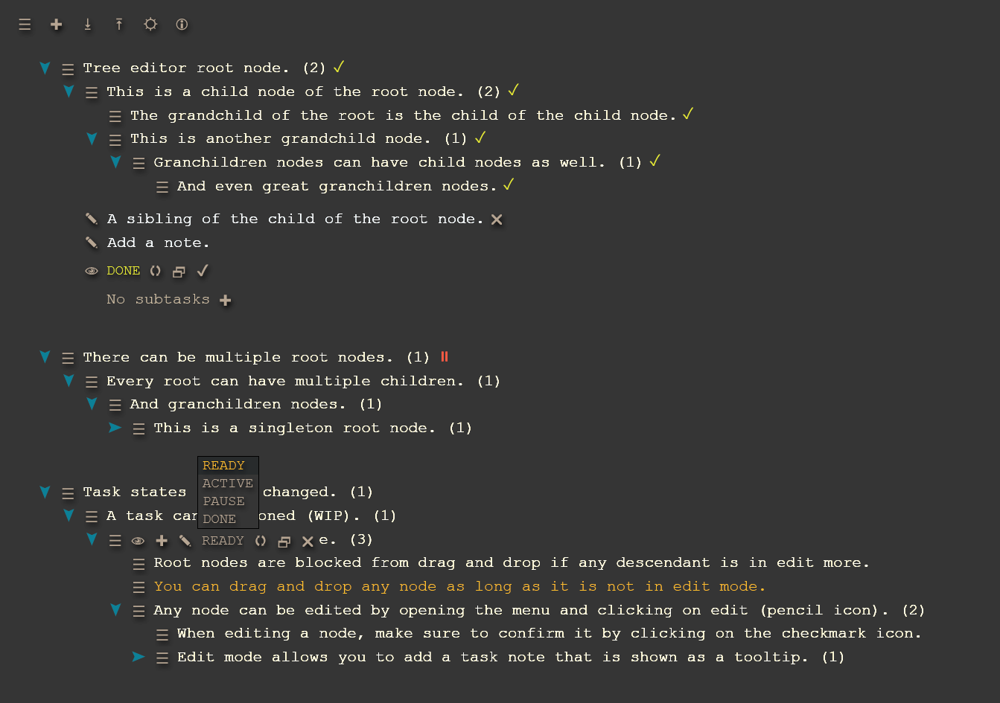

# Focus Tree

Task manager, action tracker, habit builder

## Usage

### [Live App](https://proc0.github.io/focustree/)

Local usage: clone or download, and open index.html in a browser.

## Features

- Manage tasks, track actions or steps, create reusable task trees
- Focus on any task tree and walk through it step by step
- Export and import task trees for full control over data
- Simple and straight forward implementation
- No accounts needed, no installation necessary, ready to go after downloading files
- Open source

## A simple task app with full control

This is a prototype concept to test a simplified task tree that is local only. It is a simple task tree that can be walked through and mark each task as done. More features will be added in the future.

## Stack features

- JS, HTML, CSS, IndexedDB
- Zero dependencies
- Native HTML components
- HTML templates, slots, custom elements, and use of shadow DOM

## Feedback

Please leave feedback or open any issues.
